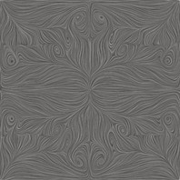
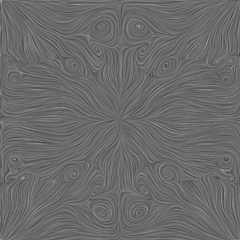
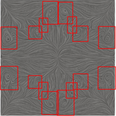
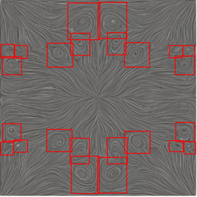
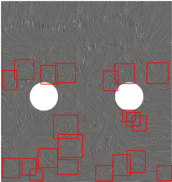
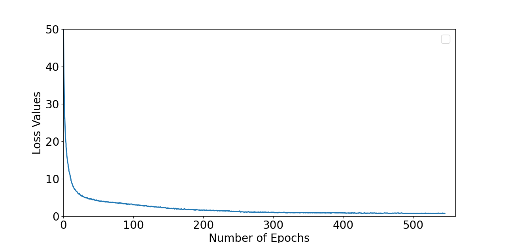
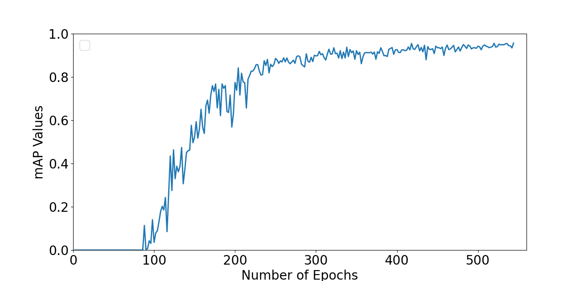

[](#)
[](https://www.python.org/)

# Table of Contents
* [Introduction](#-introduction)
2. [Installation](#2-installation)
3. [Requirements](#3-requirements)

	3.1 [Tensorboard](#31-tensorboard)
	
	3.2 [Download pretrained weights](#32-Download-pretrained-weights)
4. [Training Datasets](#4-Training-Datasets)
5. [Test Datasets](#5-Test-Datasets)
6. [Detecting vortices through computer vision](#6-Detecting-vortices-through-computer-vision)
7. [Different Study (Another test case)](#7-Different-Study-Another-test-case)

8. [References](#8-references)

# Surface line integral convolution-based vortex detection using computer vision

## [Introduction](#)
We proposed a new approach using convolutional neural networks to detect flow structures directly from streamline plots, using the line integral convolution method. We show that our computer vision-based approach is able to reduce the number of false positives and negatives entirely.

## [2. Installation](#)
If you prefer downloading the source directly through github, use
`git clone https://github.com/Hazem-Abolholl/desktop-tutorial.git`
## [3. Requirements](#)
The Vortex Detection using Computer Vision based on YOLOv3 works only on Python 3.7 and superior. The following library are installed via pip in order to run the model:
*	Torchvision
*	PyTorch/1.6.0-
*	Albumentations
*	config
*	NumPy
*	Matplotlib
*	Tensorboard

### [3.1. Tensorboard](#)
Track training progress in:
1. Mean Average Precision (mAP value)
2. Loss Function
3. Class accuracy - Object accuracy - No Object accuracy

For mAP and Loss function:
`tensorboard --logdir=logs`

For correct_class, correct_obj, and correct_Noobj:
`tensorboard --logdir=runs`

### [3.2. Download pretrained weights](*)


## [4. Training Datasets](#)
We extract a total of 100 images from the symmetry plane of “Taylor Green Vortex problem flow is simulated using Large Eddy Simulation (LES) at Re=1600” in the x-direction and label vortices on these 100 images that we process with ParaView through python scripting to generate 100 images using line integral convolution-based streamline plots.

## [5. Test Datasets](#)
We select two additional images from the symmetry plane in the x-direction, which are not part of the training datasets, and use that for testing the accuracy of our vortex detection framework based on computer vision. The two images are shown in Figure below, where test image 1, on the left-hand side, contains 16 vortices and test image 2, on the right-hand side, contains 24 vortices. We observe that the test images contain mostly symmetrical vortex structures along the main axes.

<table align="center" style="border: 0"> 
  <tr>
		<td>    
    </td>
    <td>    
    </td>

 </tr>
	<tr align="center" >
	<td><center>(a) Test image 1 with 16 vortices.</center></td>
    <td><center>(b) Test image 2 with 24 vortices.</center></td>

  </tr>
  <tr align="center">
    <td colspan="2" >Fig.1 - Test images showing vortical structures obtained with the
	    <br> line integral convolution-based streamline algorithm.</td>
  </tr>	
 </table>

## [6. Detecting vortices through computer vision](#)
To run the model on example images in `data/`:
```python
$ python CVDetection -i TestData/fileName
```


<table align="center" style="border: 0"> 
  <tr>
		<td>    
    </td>
    <td>    
    </td>

 </tr>
	<tr align="center" >
	<td><center>Test image1</center></td>
    <td><center>Test image2</center></td>

  </tr>
  <tr align="center">
    <td colspan="2" >Fig.2 - The output result of test images. The red box is the predicted bounding box</td>
  </tr>	
 </table>


## [7. Different Study (Another test case)](#)

<table align="center" style="border: 0"> 
  <tr align="center">
		<td>    
   
 </tr align="center">
	<tr align="center" >
	<td><center>Fig.3 - Detected vortex core regions using our computer <br>
		            vision approach for the turbulent boundary layer <br>
		                   case taken from Szoke et al.</center></td>
   
  </tr>
   </table>


## [8. Loss Function](#)
<table align="center" style="border: 0"> 
  <tr>
		<td>    
   
 </tr>
	<tr align="center" >
	<td><center>Fig.4 - loss values curve in the time of training epochs.</center></td>
   
  </tr>
   </table>
  
  ## [9. Mean Average Precision](#)
  
   <table align="center" style="border: 0"> 
  <tr>
		<td>    
   
 </tr>
	<tr align="center" >
	<td><center>Fig.5 - Mean Average precision curve in the time of training epochs.</center></td>
   
  </tr>
   </table>


