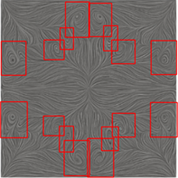
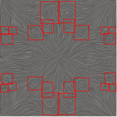

# Surface line integral convolution-based vortex detection using computer vision
**Version 1.0.0**

This is your README. READMEs are where you can communicate what your project is and how to use it.
We proposed a new approach using convolutional neural networks to detect flow structures directly from streamline plots, using the line integral convolution method. We show that our computer vision-based approach is able to reduce the number of false positives and negatives entirely.
Write your name on line 6, save it, and then head back to GitHub Desktop.

## Requirements
The Vortex Detection using Computer Vision based on YOLOv3 works only on Python 3.7 and superior. The following library are used:
*	Torchvision
*	PyTorch/1.6.0-
*	Albumentations
*	config
*	NumPy
*	Matplotlib

## Results
|  |  |
|:--:| :--:|
| <b>Fig.1 - The output result of test images. The red box is the predicted bounding box</b>|

Another Way

     &nbsp;&nbsp;&nbsp;
  
 Test image 1  &nbsp;&nbsp;&nbsp;&nbsp; &nbsp;&nbsp;&nbsp;&nbsp; &nbsp;&nbsp;&nbsp;&nbsp  &nbsp;&nbsp;&nbsp;&nbsp; &nbsp;&nbsp;&nbsp;&nbsp; &nbsp;&nbsp;&nbsp;&nbsp; 
     &nbsp;&nbsp;&nbsp;&nbsp; &nbsp;&nbsp;&nbsp;&nbsp; &nbsp;&nbsp;  Test image 2 
    

Fig.1 - The output result of test images. The red box is the predicted bounding box

 

<table cellspacing="0" cellpadding="0" align="center" border="0"> 
  <tr>
		<td>    
    </td>
    <td>    
    </td>

 </tr>
	<tr align="center" >
	<td>
Test image1
</td>
    <td>
Test image2
</td>

  </tr>
  <tr align="center">
    <td colspan="2" >Fig.1 - The output result of test images. The red box is the predicted bounding box</td>
  </tr>	
 </table>

