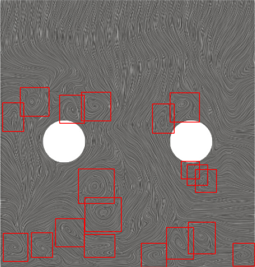

[](#)
[](https://www.python.org/)

# Table of Contents
- [Introduction](#introduction)
- [Installation](#installation)
- [Requirements](#requirements)

	- [Tensorboard](#tensorboard)
	
- [Training Datasets](#Training-Datasets)
- [Test Datasets](#Test-Datasets)
- [Results](#Results)
- [Different Study (Another test case)](#Different-Study-Another-test-case)

- [References](#references)

# Surface line integral convolution-based vortex detection using computer vision

## [Introduction](#)
We proposed a new approach using convolutional neural networks to detect flow structures directly from streamline plots, using the line integral convolution method. We show that our computer vision-based approach is able to reduce the number of false positives and negatives entirely.

## [Installation](#)
If you prefer downloading the source directly through github, use
`git clone https://github.com/Hazem-Abolholl/desktop-tutorial.git`
## [Requirements](#)
The Vortex Detection using Computer Vision based on YOLOv3 works only on Python 3.7 and superior. The following library are installed via pip in order to run the model:
*	Torchvision
*	PyTorch/1.6.0-
*	Albumentations
*	config
*	NumPy
*	Matplotlib
*	Tensorboard

### [Tensorboard](#)
Track training progress in:
1. Mean Average Precision (mAP value)
2. Loss Function
3. Class accuracy - Object accuracy - No Object accuracy

For mAP and Loss function:
`tensorboard --logdir=logs`

For correct_class, correct_obj, and correct_Noobj:
`tensorboard --logdir=runs`

## [Training Datasets](#)
We extract a total of 100 images from the symmetry plane of “Taylor Green Vortex problem flow is simulated using Large Eddy Simulation (LES) at Re=1600” in the x-direction and label vortices on these 100 images that we process with ParaView through python scripting to generate 100 images using line integral convolution-based streamline plots.

## [Test Datasets](#)
We select two additional images from the symmetry plane in the x-direction, which are not part of the training datasets, and use that for testing the accuracy of our vortex detection framework based on computer vision. The two images are shown in Figure below, where test image 1, on the left-hand side, contains 16 vortices and test image 2, on the right-hand side, contains 24 vortices. We observe that the test images contain mostly symmetrical vortex structures along the main axes.

<table align="center" style="border: 0"> 
  <tr>
		<td>    
    </td>
    <td>    
    </td>

 </tr>
	<tr align="center" >
	<td><center>(a) Test image 1 with 16 vortices.</center></td>
    <td><center>(b) Test image 2 with 24 vortices.</center></td>

  </tr>
  <tr align="center">
    <td colspan="2" >Fig.1 - Test images showing vortical structures obtained with the
	    <br> line integral convolution-based streamline algorithm.</td>
  </tr>	
 </table>

## [Results](#)
To run the model on example images in `data/`:
```python
$ python CVDetection -i TestData/fileName
```
The following code is used to load checkpoint file to test our model after training:
```python
Configration.CHECKPOINT: The path of Checkpoint file
model: Build CNN based on YOLOv3
optimizer: Adam optimizer has been used
load_checkpoint(Configration.CHECKPOINT, model, optimizer)
def load_checkpoint(checkpoint, model, optimizer):
    print("======> Loading please wait!")  
    get_checkpoint = torch.load(checkpoint, map_location=Configration.DEVICE)
    model.load_state_dict(get_checkpoint["state_dict"])
    optimizer.load_state_dict(get_checkpoint["optimizer"])
```
In order to plot the result after predicted the vortices area we need to build the model, load the image, give threshold value and scaled the anchors which three anchors for each cell.
```python
    loader = loaders(img_path=args.input_filename)
    scaled_anchors = (torch.tensor(Configration.ANCHORS)
            * torch.tensor(Configration.S).unsqueeze(1).unsqueeze(1).repeat(1, 3, 2)
    ).to(Configration.DEVICE)
    """
    Plots predicted bounding boxes on the image
    iou_threshold: threshold where predicted boxes is correct
    threshold: threshold to remove predicted bboxes (independent of IoU)
    scaled_anchors: the anchors used for the predictions which have been rescaled to be between [0, 1]
    """
    plot_image(model, loader, iou_threshold=0.6, threshold=0.5, scaled_anchors)
```

<table align="center" style="border: 0"> 
  <tr>
		<td>    
    </td>
    <td>    
    </td>

 </tr>
	<tr align="center" >
	<td><center>Test image1</center></td>
    <td><center>Test image2</center></td>

  </tr>
  <tr align="center">
    <td colspan="2" >Fig.2 - The output result of test images. The red box is the predicted bounding box</td>
  </tr>	
 </table>


## [Different Study (Another test case)](#)
In order to demonstrate the robustness of the developed vortex core detection algorithm based on computer vision, we apply the trained CNN to a different test case. Here, we use the LES data of Szoke et al., where the turbulence within a channel with streamwise rods was simulated to investigate their role on attenuate pressure fluctuations near the wall. Figure 3 shows that we are able to predict the correct vortex core region and using additional images from turbulent boundary layer flows, it is likely that we will be able to remove false positives and negatives entirely.
<table align="center" style="border: 0"> 
  <tr align="center">
		<td>    
   
 </tr align="center">
	<tr align="center" >
	<td><center>Fig.3 - Detected vortex core regions using our computer <br>
		            vision approach for the turbulent boundary layer <br>
		                   case taken from Szoke et al.</center></td>
   
  </tr>
   </table>


## [Loss Function](#)
The error between the target value and the predicted value is calculated by the loss function, using the concept of error backpropagation in the neural network and altering the weight of each layer in the network to achieve the training of the model. The figure below shows a monotonic decreasing loss function, and we can say that after about 300 epochs, that our CNN is well fitted.

<table align="center" style="border: 0"> 
  <tr>
		<td>    
   
 </tr>
	<tr align="center" >
	<td><center>Fig.4 - loss values curve in the time of training epochs.</center></td>
   
  </tr>
   </table>
  
  ## [Mean Average Precision](#)
  The figure 5 shows that a few epochs are required initially to pick up any vortices after which we can observe a steady increase in the mAP value. the max value of mean Average Precision (mAP) is 0.96 which can the model capture all the vortices without false positives and negatives.
  
   <table align="center" style="border: 0"> 
  <tr>
		<td>    
   
 </tr>
	<tr align="center" >
	<td><center>Fig.5 - Mean Average precision curve in the time of training epochs.</center></td>
   
  </tr>
   </table>


